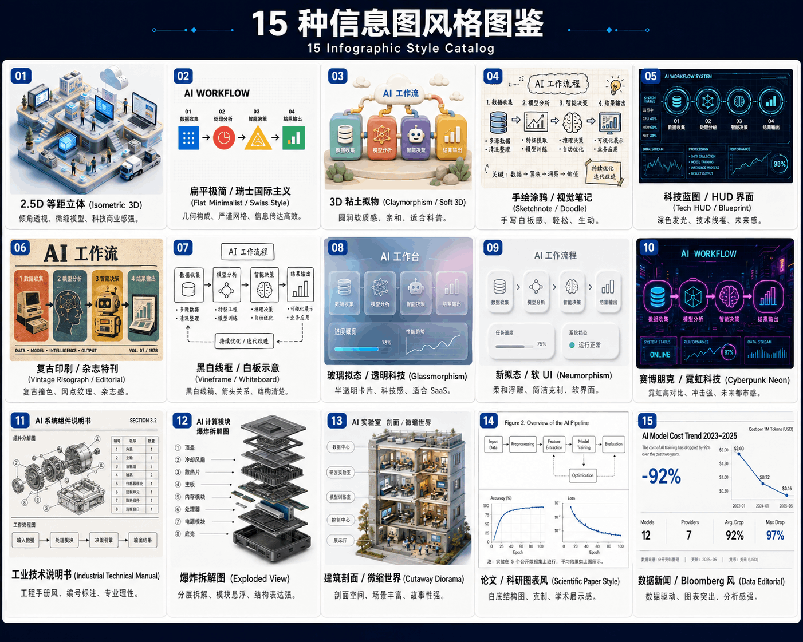

# AK2077 Skills

一个面向 AI Agent 的开源技能库，用来分享可复用、可组合、可直接落地的 Skills。

技能支持中文和英文，并会根据用户的输入语言自动适配；未指定语言时，默认使用中文。

## 当前技能

| 技能 | 说明 | 状态 |
| --- | --- | --- |
| [`ak-infographic`](./skills/ak-infographic/) | 将复杂主题、长文、技术架构或结构化数据转译为高信息密度、高可视化的专业信息图 | 可用 |

### ak-infographic

`ak-infographic` 是一个信息图分析、设计与生成技能。它会先理解和研究内容，再利用第一性原理、金字塔原理与 MECE、费曼学习法、SCQA 和系统思维完成认知拆解与视觉转译。

主要能力：

- 支持中文、英文等多语言内容，默认输出中文。
- 支持模糊主题调研、长文提炼、技术架构分析和数据可视化策划。
- 默认采用适合手机阅读的 `9:16` 竖版，也支持用于 PPT、桌面和大屏的 `16:9` 横版。
- 内置 15 种信息图风格；用户未指定风格时，会先展示图鉴并推荐合适方案。
- 生成结构化提示词文档，并可调用当前环境可用的图片生成工具完成出图。
- 不限定某一个生图模型，可配合 GPT Image、Nano Banana 等基于提示词的图像生成能力使用。
- 用户要求本地保存时，会在当前项目中建立独立目录，保存提示词和生成图片。

## 15 种信息图风格



| 编号 | 风格 | 适合内容 |
| --- | --- | --- |
| 01 | 2.5D 等距立体 | 科技产品、业务场景、系统全景 |
| 02 | 扁平极简 / 瑞士国际主义 | 流程、框架、清晰的信息传达 |
| 03 | 3D 粘土拟物 | 科普、教育、轻松友好的主题 |
| 04 | 手绘涂鸦 / 视觉笔记 | 知识总结、课程笔记、创意表达 |
| 05 | 科技蓝图 / HUD 界面 | AI 系统、技术架构、数据链路 |
| 06 | 复古印刷 / 杂志特刊 | 品牌故事、历史主题、编辑内容 |
| 07 | 黑白线框 / 白板示意 | 原理解释、关系梳理、快速沟通 |
| 08 | 玻璃拟态 / 透明科技 | SaaS、产品能力、未来科技 |
| 09 | 新拟态 / 软 UI | 简洁产品界面、状态面板 |
| 10 | 赛博朋克 / 霓虹科技 | 前沿科技、未来城市、强视觉主题 |
| 11 | 工业技术说明书 | 工程架构、专业拆解、操作流程 |
| 12 | 爆炸拆解图 | 软件栈、硬件结构、模块分层 |
| 13 | 建筑剖面 / 微缩世界 | 复杂场景、组织系统、故事化表达 |
| 14 | 论文 / 科研图表风 | 研究成果、实验流程、学术内容 |
| 15 | 数据新闻 / Bloomberg 风 | 趋势、指标、商业与数据分析 |

每种风格均提供 `9:16` 与 `16:9` 的布局方法和提示词参考，详见 [`references`](./skills/ak-infographic/references/)。

## 使用示例

安装技能后，可以直接对 Agent 说：

```text
使用 ak-infographic，帮我生成一张 DeepSeek Harness 深度分析信息图。
```

也可以进一步指定要求：

```text
把下面这篇文章制作成 2 张中文信息图，使用 05 科技蓝图风格，9:16 竖版，并将提示词和图片保存到当前项目。
```

当没有指定风格时，技能会展示上方图鉴、推荐 2–3 种适合当前内容的方案，并等待用户确认风格和张数。

## 安装

克隆仓库：

```bash
git clone git@github.com:Angus221/ak2077-skills.git
```

将需要的技能目录复制到 Agent 的技能目录。以 Codex 为例：

```powershell
Copy-Item -Recurse .\ak2077-skills\skills\ak-infographic "$env:USERPROFILE\.codex\skills\ak-infographic"
```

不同 Agent 的技能目录可能不同，请以对应产品的 Skills 配置说明为准。

## 仓库结构

```text
ak2077-skills/
├── skills/
│   └── ak-infographic/
│       ├── SKILL.md
│       ├── agents/
│       │   └── openai.yaml
│       ├── assets/
│       └── references/
├── LICENSE
└── README.md
```

后续会继续开放更多经过实际工作流验证的技能。如果你有改进建议，欢迎提交 Issue 或 Pull Request。

## 关注「安康说AI」

如果这个项目对你有帮助，欢迎关注微信公众号：**安康说AI**。

我会持续分享 AI Agent、Skills、提示词工程、AI 工作流和真实项目实践，也会同步本仓库的新技能与使用案例。

## License

[MIT](./LICENSE)
