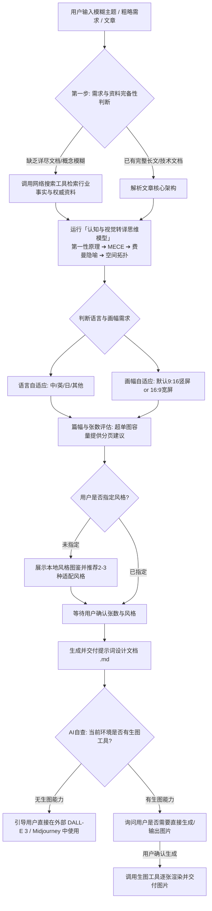

# 🎨 ak-infographic (信息图技能)

本技能专注于将复杂信息、长文本、抽象主题或结构化数据，通过**「认知与视觉转译思维模型」**转化为**媲美 DALL-E 3 / GPT 级极高完成度**的**高信息密度**、**高可视化**专业信息图（全面支持 9:16 竖屏移动优先与 16:9 宽屏桌面双版式体系），完整对应并支持 **15 种信息图风格图鉴**。

---

## 🧠 核心引擎：认知与视觉转译思维模型 (Cognitive & Visual Translation)

当用户仅给出一个概念、简略需求或没有详尽文档时，Agent **必须首先通过网络搜索深度调研**，并严格在“搜索资料”与“排版画图”之间运行以下转译体系：

### 1. 五大认知思维工具与视觉映射矩阵

| 思维工具 | 核心认知逻辑（决定“展示什么”） | 视觉转译策略（决定“怎么展示”） |
| :--- | :--- | :--- |
| **1. 第一性原理<br/>(First Principles)** | 剥离所有表象与营销术语，直击底层物理事实与核心元构件（如：把协议剥离为统一接口、无状态与上下文）。 | **核心拓扑 / 放射引擎图**：<br/>中心放置最底层的核心本质（Core Engine），向外辐射衍生出的应用与场景。 |
| **2. 金字塔原理 + MECE 原则<br/>(Pyramid & MECE)** | 结论先行、以上统下、分类相互独立且完全穷尽。 | **分层架构 + Bento 便当网格**：<br/>顶部 Header 放总结论，下层通过 2×2、2×3 或 4×2 独立卡片穷尽各个核心要素。 |
| **3. 费曼学习法<br/>(Feynman Technique)** | 降维表达，用通俗语言、物理比喻或实体隐喻解释复杂概念（如：把协议解释为“接口转换器”）。 | **3D 实体场景 + 流程图解**：<br/>用 3D 机器人、微缩工作台、传送带等生活化/实体化场景承载抽象技术。 |
| **4. SCQA 叙事模型<br/>(SCQA Framework)** | 场景(S) $\rightarrow$ 冲突(C) $\rightarrow$ 疑问(Q) $\rightarrow$ 答案(A)，制造认知共鸣与解决方案。 | **对比 / 演进双栏图**：<br/>左侧展示传统痛点与混乱状态（Before/Pain），右侧展示架构与优化解法（After/Gain）。 |
| **5. 系统动力学与时序流<br/>(Systems Thinking)** | 观察系统输入、黑盒处理、状态变化、输出与反馈闭环。 | **上下 / 左右流水线 (Pipeline)**：<br/>带状态监测点、协议标注和流向指示的流转管道与闭环回路。 |

---

### 2. AI 内部思考推理链（Chain-of-Thought）执行标准

在接收到主题并完成信息搜索/长文解析后，Agent 必须经历以下 4 步认知推演：

```text
Step 1【第一性本质提炼 (First Principles)】
  ↳ 提炼出该主题最底层的 1 个核心矛盾/本质真相（形成顶部主标题与底部核心金句）。
Step 2【MECE 维度拆解 (Pyramid Breakdown)】
  ↳ 提炼出支撑该本质的 3~6 个互不重叠的核心要素（作为 Bento 网格卡片内容）。
Step 3【费曼隐喻与视觉锚点 (Feynman & Anchor)】
  ↳ 构建具象的物理模型或拓扑隐喻（如：分层三明治、流水线传送带、指挥中心全息看板）。
Step 4【空间拓扑排布 (Spatial Mapping)】
  ↳ 规划视线动线：从上到下（分层架构/竖屏流）、从左到右（时序流转/宽屏大盘）、从内到外（核心辐射）。
```

---

## 📌 核心准则一：双画幅版式体系 (9:16 竖屏 vs 16:9 宽屏)

| 画幅比例 | 适用场景 | 布局核心思路 | 典型视觉动线与组件 |
| :--- | :--- | :--- | :--- |
| **📱 9:16 竖屏**<br/>*(移动端默认优先)* | 手机全屏阅读、微信长图、小红书、社交媒体 | **单列/双列垂直级联流**<br/>自上而下滚动动线 | 顶部聚焦主视觉与核心大数 $\rightarrow$ 中部纵向 4~7 个级联卡片/状态流 $\rightarrow$ 底部收尾数据指标与行动标语 |
| **🖥️ 16:9 宽屏**<br/>*(桌面/汇报优先)* | 电脑大屏、PPT/Keynote 演示、技术白皮书横版插图、控制台全景 | **横向多栏/中枢辐射网格**<br/>自左向右/中心发散动线 | 左侧输入与接入网关 $\rightarrow$ 中央核心架构拓扑/3D沙盘 $\rightarrow$ 右侧遥测监控与数据分析 $\rightarrow$ 底部横贯指标栏 |

> **默认规则**：若用户未显式指定比例，默认优先采用 **9:16 竖屏**；若用户提到“PPT”、“大屏”、“电脑端”、“宽屏”或显式指定 16:9，则自适应切换为 **16:9 宽屏版式**。

---

## 📌 核心准则二：用户语言自适应判断 (Dynamic Language Adaptation)

1. **自动语言检测与继承**：
   - 自动检测当前**对话用户所使用的语言**及**输入文本的语言**（如：简体中文、繁体中文、English、日本語、Español 等）。
   - **信息图版面上的所有文案（主标题、副标题、模块名称、步骤说明、图表指标、底部标语等）必须以检测到的用户语言为绝对主体输出**。
2. **专业术语保留标准**：
   - 国际公认的技术缩写、协议与代码（如 `API`、`OAuth`、`MCP`、`JSON-RPC`、`Trace Context`、`SLA`、`QPS` 等）在各语言中保持规范英文原名。
3. **提示词内的显式字面指定**：
   - 在编写 AI 绘图提示词时，必须把该语言下的**确切字面文字用双引号逐字声明**，确保绘图模型精准渲染文字。

---

## 📌 核心工作流与交互规范



### 未指定风格时展示本地图鉴

当用户没有指定信息图风格时，必须执行以下步骤：

1. 先根据内容特征推荐 2–3 种适配风格，并简要说明推荐理由。
2. 以当前 `SKILL.md` 所在目录为基准，定位技能内的相对资源 `assets/infographic-style-catalog.png`，并将其解析为绝对文件路径。
3. 使用解析后的绝对路径向用户输出 Markdown。路径包含空格时保留尖括号；不要把仓库开发机上的固定绝对路径写死到技能中：

   ```markdown
   
   ```

4. 请用户根据图鉴选择风格编号或名称，并确认生成张数。
5. 若无法定位或展示本地图片，回退到下方“15 种信息图风格完全对照索引表”供用户选择。
6. 若用户已经明确指定风格，跳过图鉴展示并直接进入后续流程。

---

## 📁 本地输出与提示词文档规范

当用户要求将提示词或图片保存到本地时，按以下规则创建输出目录：

1. 若用户指定保存路径，优先使用用户指定的位置。
2. 若用户未指定路径，定位当前激活项目的根目录；优先使用工作区根目录或 Git 仓库根目录，否则使用当前工作目录。
3. 在项目根目录下创建 `ak-infographic/<topic-slug>-<YYYYMMDD-HHmmss>/`，例如：

   ```text
   <project-root>/ak-infographic/ai-agent-architecture-20260818-153000/
   ├── prompt.md
   ├── image-01.png
   └── image-02.png
   ```

4. 使用简短、可识别的小写连字符主题名作为 `<topic-slug>`，并用时间戳避免覆盖历史结果。
5. 将最终提示词保存为 `prompt.md`；图片按生成顺序命名为 `image-01.png`、`image-02.png`，并保留实际图片格式对应的扩展名。
6. 仅在用户要求本地保存时创建目录，不自动修改项目的 `.gitignore`。

生成 `prompt.md` 时，文件最顶部第一行必须使用以下句式，且在其前面不要添加标题、frontmatter 或其他内容：

```text
帮我生成X张高信息密度，高可视化的信息图，内容如下：
```

将 `X` 替换为最终确认的实际张数，例如 `帮我生成3张高信息密度，高可视化的信息图，内容如下：`。第一行之后空一行，再写完整的信息图内容、布局要求、风格与绘图提示词。

---

## 1. 15 种信息图风格完全对照索引表

所有 15 种风格的独立规范文件均存放在 [`references/`](./references/) 目录中，每个风格文件均包含 9:16 竖屏与 16:9 宽屏双布局思路与完整 Prompt：

| 序号 | 风格名称 | 英文标识 | 核心视觉特征 | 独立资源文件 |
| :--- | :--- | :--- | :--- | :--- |
| **01** | **2.5D 等距立体** | Isometric 3D | 倾角透视、微缩模型、科技商业感强 | [查看文档](./references/style_01_isometric_3d.md) |
| **02** | **扁平极简 / 瑞士国际主义** | Flat Minimalist / Swiss Style | 几何构成、严谨网格、信息传达高效 | [查看文档](./references/style_02_flat_minimalist_swiss.md) |
| **03** | **3D 粘土拟物** | Claymorphism / Soft 3D | 圆润软质感、亲和、适合科普 | [查看文档](./references/style_03_claymorphism_soft3d.md) |
| **04** | **手绘涂鸦 / 视觉笔记** | Sketchnote / Doodle | 手写白板感、轻松、生动 | [查看文档](./references/style_04_sketchnote_doodle.md) |
| **05** | **科技蓝图 / HUD 界面** | Tech HUD / Blueprint | 深色发光、技术线框、未来感 | [查看文档](./references/style_05_tech_hud_blueprint.md) |
| **06** | **复古印刷 / 杂志特刊** | Vintage Risograph / Editorial | 复古撞色、网点纹理、杂志感 | [查看文档](./references/style_06_vintage_risograph.md) |
| **07** | **黑白线框 / 白板示意** | Wireframe / Whiteboard | 黑白线简、箭头关系、结构清楚 | [查看文档](./references/style_07_wireframe_whiteboard.md) |
| **08** | **玻璃拟态 / 透明科技** | Glassmorphism | 半透明卡片、科技感、适合 SaaS | [查看文档](./references/style_08_glassmorphism.md) |
| **09** | **新拟态 / 软 UI** | Neumorphism | 柔和浮雕、简洁克制、软界面 | [查看文档](./references/style_09_neumorphism_soft_ui.md) |
| **10** | **赛博朋克 / 霓虹科技** | Cyberpunk Neon | 霓虹高对比、冲击强、未来都市感 | [查看文档](./references/style_10_cyberpunk_neon.md) |
| **11** | **工业技术说明书** | Industrial Technical Manual | 工程手册风、编号标注、专业理性 | [查看文档](./references/style_11_industrial_manual.md) |
| **12** | **爆炸拆解图** | Exploded View | 分层拆解、模块悬浮、结构表达强 | [查看文档](./references/style_12_exploded_view.md) |
| **13** | **建筑剖面 / 微缩世界** | Cutaway Diorama | 剖面空间、场景丰富、故事性强 | [查看文档](./references/style_13_cutaway_diorama.md) |
| **14** | **论文 / 科研图表风** | Scientific Paper Style | 白底结构图、克制、学术展示感 | [查看文档](./references/style_14_scientific_paper.md) |
| **15** | **数据新闻 / Bloomberg 风** | Data Editorial | 数据驱动、图表突出、分析感强 | [查看文档](./references/style_15_data_editorial_bloomberg.md) |
